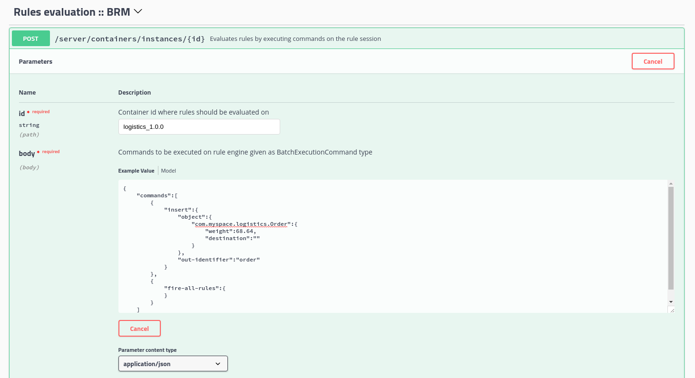

= 规则服务
:toc: manual

== 云原生能力

*starter 模版*

https://start.jbpm.org/ 

== 复杂事件处理

http://ksoong.org/drools-examples/content/cep-fraud-detection-springboot/

== 规则服务化部署

link:rhdm72-image-streams.yaml[rhdm72-image-streams.yaml]

link:rhdm72-ephemeral.yaml[rhdm72-ephemeral.yaml]

[source, text]
.*1. 创建 ImageStream*
----
$ oc create -f rhdm72-image-streams.yaml -n openshift
----

[source, text]
.*2. 创建模版*
----
$ oc create -f rhdm72-ephemeral.yaml 
----

[source, text]
.*3. 部署*
----
$ oc new-app rhdm72-trial-ephemeral
--> Deploying template "rules-service/rhdm72-trial-ephemeral" to project rules-service

     Red Hat Decision Manager 7.2 ephemeral trial environment
     ---------
     Application template for an ephemeral authoring and testing environment, for Red Hat Decision Manager 7.2

     A new Decision Manager trial environment has been created.
     The username/password for accessing the Decision Central interface is
     
         Username: adminUser
         Password: RedHat
     
     The user name/password for calls to the KIE server is
     
         Username: executionUser
         Password: RedHat
     
     Please remember that this is an ephemeral environment and any work will be LOST with a simple pod restart.

     * With parameters:
        * Application Name=myapp
        * Default Password=RedHat
        * KIE Admin User=adminUser
        * KIE Server User=executionUser
        * KIE Server Bypass Auth User=false
        * KIE Server Controller User=controllerUser
        * KIE MBeans=enabled
        * Drools Server Filter Classes=true
...
----

== 配送规则案例

http://ksoong.org/drools-examples/content/docs/rhdm.html#_1_project

* 通过 http://myapp-rhdmcentr-rules-service.apps.example.com 访问在线设计界面。
* 通过 http://myapp-kieserver-rules-service.apps.example.com/docs/ 访问 API 列表。

测试截图：

结果返回：

[source, json]
----
{
  "type" : "SUCCESS",
  "msg" : "Container logistics_1.0.0 successfully called.",
  "result" : {
    "execution-results" : {
      "results" : [ {
        "value" : {"com.myspace.logistics.Order":{
  "merchant" : null,
  "weight" : 68.64,
  "expedited" : null,
  "destination" : "仓库 A"
}},
        "key" : "order"
      } ],
      "facts" : [ {
        "value" : {"org.drools.core.common.DefaultFactHandle":{
  "external-form" : "0:1:2097530854:2097530854:2:DEFAULT:NON_TRAIT:com.myspace.logistics.Order"
}},
        "key" : "order"
      } ]
    }
  }
}
----

